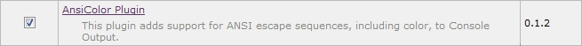
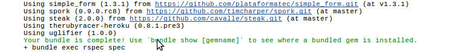
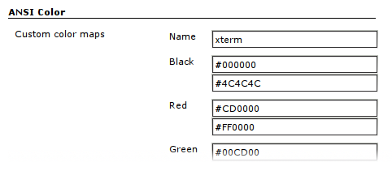
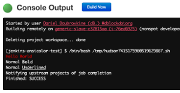

# Jenkins ANSI Color Plugin

[](https://ci.jenkins.io/job/Plugins/job/ansicolor-plugin/job/master/)
[](https://plugins.jenkins.io/ansicolor/)
[](https://plugins.jenkins.io/ansicolor/)

This plugin adds support for standard ANSI escape sequences, including color, to Console Output.

This plugin is available [here](http://repo.jenkins-ci.org/releases/org/jenkins-ci/plugins/ansicolor/)
and has [a page](https://wiki.jenkins-ci.org/display/JENKINS/AnsiColor+Plugin) on the Jenkins Wiki.

# Install

#### Using Plugin Manager



#### Using Jenkins CLI client

```
java -jar jenkins-cli.jar install-plugin ansicolor
```
# Enable

## In a Pipeline

There are 2 ways to explicitly enable `ansicolor` functionality in a pipeline: as a build wrapper - the cleanest and most preferable one
or as a pipeline step - good for quick checks when you only need part of the output colored.

### Build wrapper

Can be used to colorize the *whole* output of a pipeline build. Here is an example rendering a colorful message.

```groovy
pipeline {
    agent any
    options {
        ansiColor('xterm')
    }
    stages {
        stage('Build') {
            steps {
                echo '\033[34mHello\033[0m \033[33mcolorful\033[0m \033[35mworld!\033[0m'
            }
        }
    }
}
```

### Pipeline step

With the following syntax you can use the plugin without allocating a node or a separate build wrapper.

```groovy
ansiColor('css') {
  sh "ls -al"
}

echo 'this will be rendered as-is'
// multiple ansiColor steps within one pipeline are also supported

ansiColor('vga') {
  echo '\033[42m\033[97mWhite letters, green background\033[0m'
}
```

The `TERM` environment variable will be set to the provided name inside the block scope.

```groovy
ansiColor('xterm') {
  echo "TERM=${env.TERM}"
  // prints out TERM=xterm
}
```

## Colormaps

The argument to the ansiColor function can be either `xterm`, `vga`, `gnome-terminal` or `css`. This defines which colors Jenkins should show for some of the escape codes. The exact color values used in each set are defined in [AnsiColorMap.java](src/main/java/hudson/plugins/ansicolor/AnsiColorMap.java#L79).

## In a traditional job

Traditional, Jenkins UI defined jobs, can also take advantage of `ansicolor` by enabling it under "Build Environment" settings.


Example output:



# Customize




## In global settings

This option is the most suitable when you already have a large amount of jobs and you would like to enable `ansicolor` functionality for all of them in one go.
In order to use it you need to specify _Global color map for all builds_ on the Global configuration page available under:
```
Jenkins -> Manage Jenkins -> Configure System
```


# Misc

## Does it Even Work?

Create a job in Jenkins that executes the following shell script. Don't forget to check the "Color the ANSI Console Output" option.

    printf "\e[31mHello World\e[0m\n"
    printf "Normal \e[1mBold\e[0m\n"
    printf "Normal \e[4mUnderlined\e[0m\n"



Check out [this guide](http://misc.flogisoft.com/bash/tip_colors_and_formatting) for more examples.

## Notes on the shells Zsh and Bash

If you commonly use **Zsh** as your login shell, it's important to keep in mind
that the `echo` command (shell builtin) supports character escaping.

**Bash** however, does not.

This can cause you a bit of confusion. For example, if you test your
shell scripts (which use `echo`) in Zsh, and they work fine.  Then you
try to run them as part of a job on Jenkins (which will use be using
Bash by default), it's quite possible you won't see colorized output,
instead, you only see the ANSI control codes, still embedded in your
text.

There are ways around this, however, we recommend you use the `printf`
command instead. It'll _just work_ everywhere, and allow `\e`, `\033`
or `\x1b` to be used as the escape character.

For example:

    printf "\e[31mHello\e[0m\n"
    printf "\033[31mHello\033[0m\n"
    printf "\x1b[31mHello\x1b[0m\n"

Will all print Hello in red on any system / shell that has `printf` (ie. anything POSIX compliant)

## Supported ANSI Color Codes and Attributes

Most of the attributes and color modes described at [wikipedia/ANSI escape code](https://en.wikipedia.org/wiki/ANSI_escape_code)
were supported, including:

- attributes bold / italic / underline / negative / conceal / crossed-out / framed / overlined
- standard text colors 30-37 and background colors 40-47
- high intensity text colors 90-97 and background colors 100-107 (aixterm)
- xterm 256 colors and ISO-8613-3 24 bit colors (38 and 48)

Not supported attributes:

- faint
- blink
- font switching
- encircled
- ideogram attributes 60-65

The `colorize` ruby library, for example, emits high intensity codes when using the "light" color options.

## Colorizing Ruby RSpec Output

RSpec formatters detect whether RSpec is running in a terminal or not, therefore suppressing color output under Jenkins. Specify `--colour --tty` when calling rspec or add it to your `.rspec` file.

# License

The ANSI Color Plugin is licensed under the MIT License.

It uses [JANSI](https://github.com/fusesource/jansi/) (Apache 2.0 License).

# Contributing

See [CONTRIBUTING](.github/CONTRIBUTING.md).
